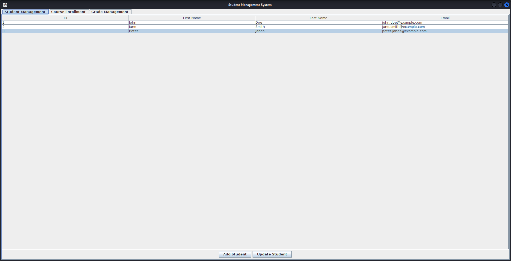

# GUI Student Management System


A desktop-based application built with **Java Swing** that provides a clean, user-friendly graphical interface for managing student records, course enrollments, and grades.

## Preview


## Features

-   **Full Student CRUD Functionality**:
    -   **View** a complete list of all students in a clear, sortable table.
    -   **Add** new students to the system through a simple, intuitive form.
    -   **Update** existing student information seamlessly.
-   **Dynamic Course Enrollment**:
    -   Select a course from a dropdown menu.
    -   Instantly view a list of students eligible for enrollment.
    -   Enroll students in a course with a single click.
-   **Efficient Grade Management**:
    -   Select a student to view all their enrolled courses and current grades.
    -   Assign or update grades for any course.
-   **Responsive & Dynamic UI**:
    -   The interface updates in real-time to reflect any changes made to student records, enrollments, or grades without needing a manual refresh.
-   **User-Friendly Error Handling**:
    -   Provides clear, non-disruptive dialog boxes to guide the user in case of invalid input or operational errors.

## Technology Stack

-   **Language**: Java
-   **Framework**: Java Swing (for the GUI)
-   **Build/Run**: Standard JDK

## Getting Started

Follow these instructions to get a copy of the project up and running on your local machine.

### Prerequisites

You need to have the Java Development Kit (JDK) installed on your system. Version 8 or higher is recommended.

You can verify your installation by opening a terminal or command prompt and typing:

```sh
java -version
```

### Installation & Usage

1.  **Clone the repository:**

    ```sh
    git clone https://github.com/Toothless5143/gui-student-management-system.git
    ```

2.  **Navigate to the project directory:**

    ```sh
    cd gui-student-management-system
    ```

3.  **Compile the Java source files:**

    ```sh
    javac *.java
    ```

4.  **Run the application:**

    ```sh
    java StudentManagementSystem
    ```

The Student Management System window should now appear on your screen.

## Code Structure

The project follows a design inspired by the **Model-View-Controller (MVC)** pattern to ensure a clean separation of concerns, making the code more readable, scalable, and maintainable.

-   **Model**: Manages the application's data and business logic.
    -   `Student.java`, `Course.java`, `Enrollment.java`: Plain Old Java Objects (POJOs) that represent the core data entities.
    -   `DataManager.java`: Acts as an in-memory database and service layer, handling all data manipulations.

-   **View / Controller**: Responsible for the user interface and handling user interactions.
    -   `StudentManagementSystem.java`: The main application class that sets up the main window and the tabbed pane.
    -   `StudentPanel.java`, `EnrollmentPanel.java`, `GradePanel.java`: These classes represent the different tabs in the UI. They are responsible for displaying data and contain the event listeners (`ActionListener`) that respond to user actions (button clicks, item selections).
    -   Custom `AbstractTableModel` classes are used within each panel to efficiently link the `JTable` components to the underlying data, enabling dynamic updates.

## Future Enhancements

This project serves as a strong foundation. Future improvements could include:

-   **Data Persistence**: Integrate with a database (like SQLite or H2) or save/load data from files (JSON/CSV) so that records are not lost when the application closes.
-   **Advanced Search & Filtering**: Add search bars to filter students or courses by name/ID.
-   **User Authentication**: Implement a login system to differentiate between user roles (e.g., administrator, instructor).
-   **Reporting**: Add functionality to generate and export reports (e.g., a student's transcript or a course roster) as a PDF or CSV file.

## License

This project is licensed under the MIT License - see the `LICENSE` file for details.
